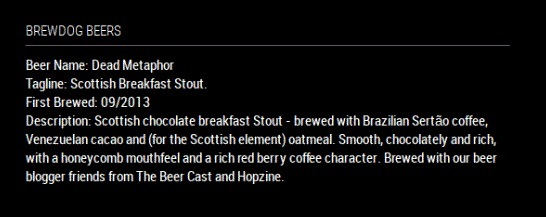

# MMM-Brewdog [](https://raw.githubusercontent.com/fewieden/MMM-ip/master/LICENSE)

Simple module for MagicMirror<sup>2</sup> that utilizes the Brewdog API to fetch a random beer

API: https://api.punkapi.com/v2/beers/random (no key needed)


## Example



## Dependencies

* An installation of [MagicMirror<sup>2</sup>](https://github.com/MichMich/MagicMirror)
* No other dependencies required

## Installation

1. Clone this repo: `git clone https://github.com/mykle1/MMM-LICE` into `~/MagicMirror/modules` directory. 
1. Configure your `~/MagicMirror/config/config.js`:

```
{
    module: 'MMM-Brewdog',
    position: 'top_left',
    config: {
        ...
    }
}
```

## Config Options

| **Option** | **Default** | **Description** |
| --- | --- | --- |
| `useHeader` | `true` | Boolean for header visibility |
| `header` | `'Brewdog Beers'` | Change to whatever you want |
| `updateInterval` | `60000` | How often until we get another beer |
